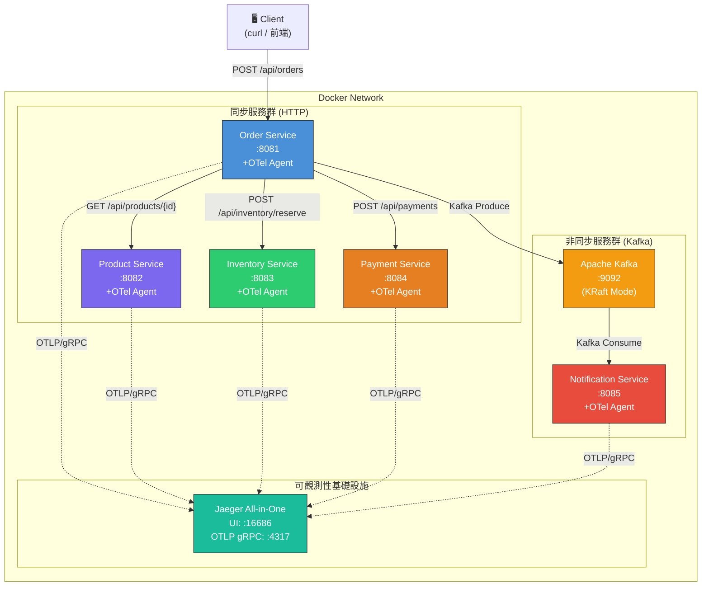
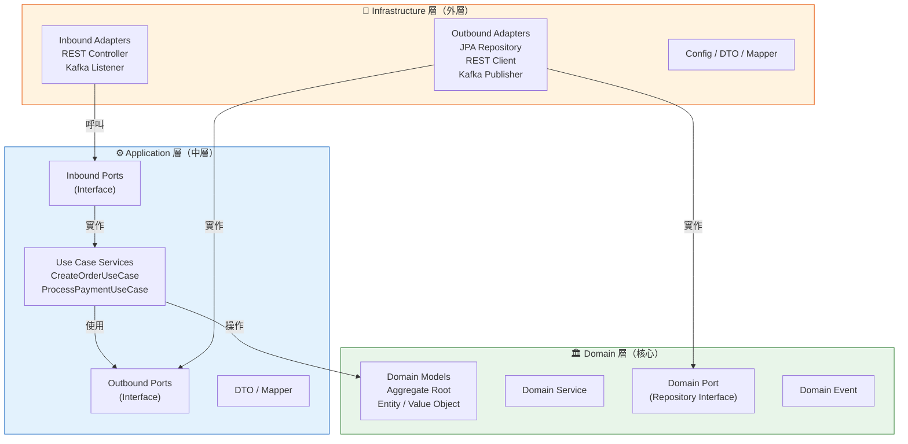
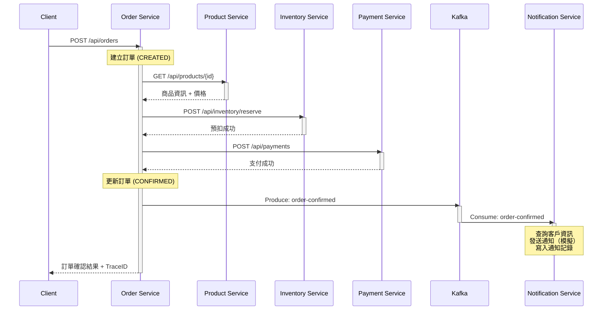
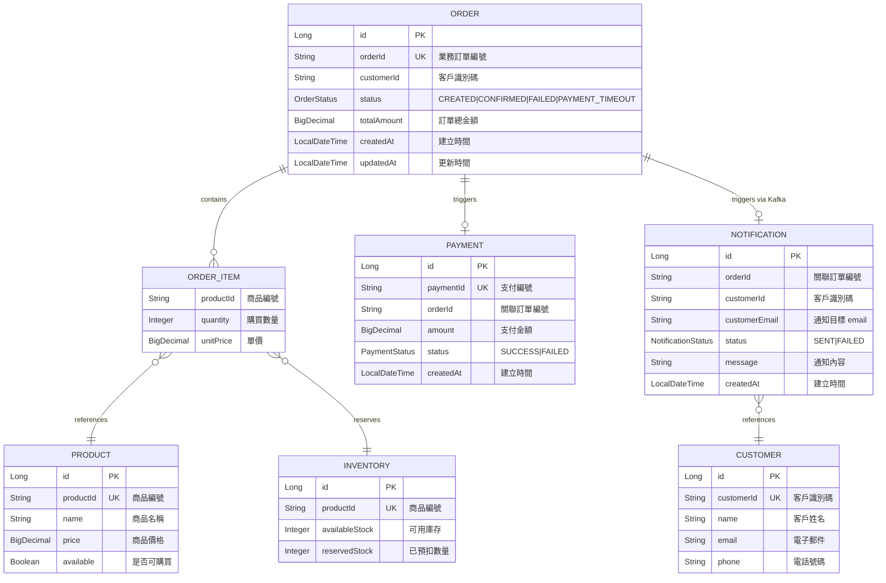
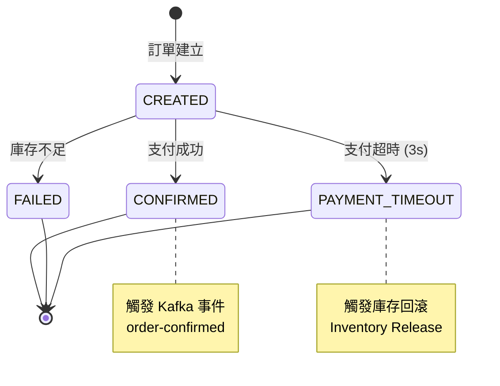

# 電子商務分散式追蹤 PoC — OpenTelemetry Java Agent

> 使用 OpenTelemetry Java Agent **零侵入**方式，為 Spring Boot 2 / JDK 8 微服務導入分散式追蹤（Distributed Tracing），涵蓋同步 HTTP、非同步 Kafka、JDBC 三種通訊模式的端到端可觀測性。

---

## 目錄

- [專案簡介](#專案簡介)
- [背景與動機](#背景與動機)
- [技術架構](#技術架構)
  - [系統架構圖](#系統架構圖)
  - [六角形架構（Hexagonal Architecture）](#六角形架構hexagonal-architecture)
  - [服務呼叫鏈路](#服務呼叫鏈路)
  - [Trace Span 結構](#trace-span-結構)
- [資料模型（ER Diagram）](#資料模型er-diagram)
  - [訂單狀態轉換](#訂單狀態轉換)
- [API 清單](#api-清單)
  - [REST API](#rest-api)
  - [非同步事件（Kafka）](#非同步事件kafka)
  - [管理端點](#管理端點)
- [技術棧](#技術棧)
- [前置需求](#前置需求)
- [快速開始（Step by Step）](#快速開始step-by-step)
  - [1. 取得原始碼](#1-取得原始碼)
  - [2. 建置所有微服務](#2-建置所有微服務)
  - [3. 啟動 Docker Compose 環境](#3-啟動-docker-compose-環境)
  - [4. 驗證服務狀態](#4-驗證服務狀態)
- [業務場景驗證](#業務場景驗證)
  - [場景一：正常下單（Happy Path）](#場景一正常下單happy-path)
  - [場景二：庫存不足](#場景二庫存不足)
  - [場景三：支付超時](#場景三支付超時)
  - [場景四：Kafka 非同步通知](#場景四kafka-非同步通知)
  - [場景五：Kafka 消費失敗與 DLT](#場景五kafka-消費失敗與-dlt)
- [Jaeger UI 操作指南](#jaeger-ui-操作指南)
- [效能基準測試](#效能基準測試)
- [OpenTelemetry Java Agent 說明](#opentelemetry-java-agent-說明)
  - [什麼是零侵入（Zero-Instrumentation）？](#什麼是零侵入zero-instrumentation)
  - [Agent 自動攔截範圍](#agent-自動攔截範圍)
  - [Context Propagation 原理](#context-propagation-原理)
- [專案結構](#專案結構)
- [環境清理](#環境清理)
- [常見問題（FAQ）](#常見問題faq)
- [參考資料](#參考資料)

---

## 專案簡介

本專案是一個**概念驗證（Proof of Concept）**，目標是驗證在不修改任何業務程式碼的前提下，透過 OpenTelemetry Java Agent 為既有的 Spring Boot 2 微服務系統導入完整的分散式追蹤能力。

**核心驗證目標：**

| 編號 | 目標 | 說明 |
|------|------|------|
| BG-1 | 端到端可視化 | 在 Jaeger UI 看到完整的下單呼叫鏈 |
| BG-2 | 效能瓶頸定位 | 透過 Trace 識別延遲超過 500ms 的服務節點 |
| BG-3 | 零程式碼修改 | 既有服務程式碼無需任何變更 |
| BG-4 | 效能影響評估 | 量化 Agent 對啟動時間與回應時間的影響 |
| BG-5 | Kafka 非同步追蹤 | Kafka Producer → Consumer 串聯在同一條 Trace |
| BG-6 | DB 存取追蹤 | JDBC 操作自動產生 Span，含 SQL 語句與執行時間 |

---

## 背景與動機

企業電子商務平台採用微服務架構，隨著系統規模成長，跨服務呼叫鏈路的可觀測性成為營運痛點：

- **客服無法快速定位瓶頸** — 客戶下單後遇到延遲，不知道是哪個服務造成
- **缺乏端到端延遲分析** — 促銷活動期間效能下降，無法量化問題
- **服務依賴關係不透明** — 架構治理缺乏數據支撐
- **非同步鏈路不可追蹤** — Kafka 事件處理過程中的故障難以排查

本 PoC 以 5 個微服務模擬真實電商場景，驗證 OpenTelemetry Java Agent 方案的可行性。

---

## 技術架構

### 系統架構圖



### 六角形架構（Hexagonal Architecture）

每個微服務都遵循六角形架構（Ports & Adapters），確保業務邏輯與基礎設施解耦：



**層級依賴規則：**

| 來源層 | 可存取 | 不可存取 |
|--------|--------|----------|
| Infrastructure | Application, Domain | — |
| Application | Domain | Infrastructure（須透過 Port） |
| Domain | — | Application, Infrastructure |

> 此規則透過 ArchUnit 測試在編譯期自動驗證，確保架構不被破壞。

### 服務呼叫鏈路



### Trace Span 結構

以下是在 Jaeger UI 中看到的 Span 時間軸結構：

```
order-service: POST /api/orders                          [───────────────────────]
  ├─ product-service: GET /api/products/P001               [────]
  │    └─ H2: SELECT                                         [─]
  ├─ inventory-service: POST /api/inventory/reserve            [─────]
  │    └─ H2: UPDATE                                             [──]
  ├─ payment-service: POST /api/payments                           [───────]
  │    └─ H2: INSERT                                                  [──]
  ├─ H2: UPDATE orders                                                     [─]
  └─ kafka.produce: order-confirmed                                        [─]
       └─ notification-service: kafka.consume                               [────────]
            ├─ H2: SELECT customers                                            [──]
            └─ H2: INSERT notifications                                             [──]
```

---

## 資料模型（ER Diagram）



**各服務資料表歸屬：**

| 服務 | 資料表 | 說明 |
|------|--------|------|
| Order Service | `orders`, `order_items` | 訂單聚合根 |
| Product Service | `products` | 商品目錄（唯讀參考資料） |
| Inventory Service | `inventory` | 庫存管理 |
| Payment Service | `payments` | 支付記錄 |
| Notification Service | `notifications`, `customers` | 通知記錄與客戶參考資料 |

### 訂單狀態轉換



---

## API 清單

### REST API

#### Order Service（訂單編排服務）— Port 8081

| 方法 | 路徑 | 說明 | 請求範例 | 回應範例 |
|------|------|------|----------|----------|
| POST | `/api/orders` | 建立訂單 | `{"customerId":"C001","items":[{"productId":"P001","quantity":2}]}` | `{"orderId":"ORD-...","status":"CONFIRMED","totalAmount":1990.00,"traceId":"..."}` |

**建立訂單流程：** 接收下單請求 → 查詢商品價格 → 預扣庫存 → 發起支付 → 確認訂單 → 發送 Kafka 事件

---

#### Product Service（商品服務）— Port 8082

| 方法 | 路徑 | 說明 | 回應範例 |
|------|------|------|----------|
| GET | `/api/products/{productId}` | 查詢商品資訊 | `{"productId":"P001","name":"無線藍牙耳機","price":995.00,"available":true}` |

**預設商品資料：**

| productId | 名稱 | 價格 | 可用 |
|-----------|------|------|------|
| P001 | 無線藍牙耳機 | 995.00 | true |
| P002 | USB-C 充電線 | 299.00 | true |
| P003 | 螢幕保護貼 | 199.00 | true |

---

#### Inventory Service（庫存服務）— Port 8083

| 方法 | 路徑 | 說明 | 請求範例 | 回應範例 |
|------|------|------|----------|----------|
| POST | `/api/inventory/reserve` | 庫存預扣 | `{"productId":"P001","quantity":2}` | `{"reserved":true,"remainingStock":48}` |
| POST | `/api/inventory/release` | 庫存回滾 | `{"productId":"P001","quantity":2}` | `{"released":true}` |

**預設庫存資料：**

| productId | 可用庫存 | 已預扣 |
|-----------|----------|--------|
| P001 | 50 | 0 |
| P002 | 100 | 0 |
| P003 | 200 | 0 |

---

#### Payment Service（支付服務）— Port 8084

| 方法 | 路徑 | 說明 | 請求範例 | 回應範例 |
|------|------|------|----------|----------|
| POST | `/api/payments` | 發起支付（模擬） | `{"orderId":"ORD-...","amount":1990.00}` | `{"paymentId":"PAY-001","status":"SUCCESS"}` |

> Order Service 呼叫 Payment Service 的 HTTP timeout 為 **3 秒**。

---

### 非同步事件（Kafka）

| Topic | Producer | Consumer | 說明 |
|-------|----------|----------|------|
| `order-confirmed` | Order Service | Notification Service | 訂單確認事件 |
| `order-confirmed.DLT` | Spring Kafka（自動） | — | Dead Letter Topic（消費失敗） |

**OrderConfirmedEvent Payload：**

```json
{
  "orderId": "ORD-20260207-001",
  "customerId": "C001",
  "customerEmail": "wang@example.com",
  "items": [
    { "productId": "P001", "quantity": 2, "unitPrice": 995.00 }
  ],
  "totalAmount": 1990.00,
  "status": "CONFIRMED",
  "timestamp": "2026-02-07T10:30:45Z"
}
```

### 管理端點

| 服務 | 方法 | 路徑 | 說明 |
|------|------|------|------|
| Payment Service | POST | `/api/admin/simulate-delay?ms=5000` | 設定支付處理延遲（毫秒） |
| Notification Service | POST | `/api/admin/simulate-failure?enabled=true` | 開啟/關閉消費失敗模擬 |

---

## 技術棧

| 元件 | 技術 | 版本 | 說明 |
|------|------|------|------|
| Runtime | OpenJDK | 8 | 既有環境限制 |
| Framework | Spring Boot | 2.7.18 | 最後的 2.x 穩定版 |
| HTTP Client | RestTemplate | Spring Boot 內建 | 服務間同步呼叫 |
| Messaging | Spring Kafka | 2.9.x | 非同步事件驅動通訊 |
| Message Broker | Apache Kafka | 3.6.x (KRaft) | 無 ZooKeeper 模式 |
| Database | H2 | 內嵌模式 | PoC 用途，簡化部署 |
| ORM | Spring Data JPA | 2.7.x | 資料存取 |
| Tracing Agent | OpenTelemetry Java Agent | 1.32.1 | 最後支援 JDK 8 的版本 |
| Tracing Backend | Jaeger | latest (all-in-one) | OTLP 接收 + 追蹤 UI |
| Container | Docker Compose | 最新穩定版 | 環境編排 |
| Architecture Test | ArchUnit | 最新版 | 六角形架構合規驗證 |
| Unit Test | JUnit 5 | 最新版 | 測試框架 |

---

## 前置需求

在開始之前，請確保你的電腦已安裝以下工具：

| 工具 | 最低版本 | 安裝說明 |
|------|----------|----------|
| **Docker Desktop** | 最新穩定版 | 包含 Docker Compose。[下載頁面](https://www.docker.com/products/docker-desktop/) |
| **JDK 8** | OpenJDK 8 | 建議使用 [Adoptium](https://adoptium.net/) 發行版 |
| **Maven** | 3.6+ | [下載頁面](https://maven.apache.org/download.cgi) |
| **curl** | 任意版本 | 大多數作業系統已內建 |
| **jq**（選用） | 任意版本 | JSON 格式化輸出。`brew install jq` 或 `apt install jq` |

**驗證安裝：**

```bash
# 驗證 Java 版本
java -version
# 預期輸出：openjdk version "1.8.0_xxx"

# 驗證 Maven
mvn -version

# 驗證 Docker
docker --version
docker compose version

# 驗證 curl
curl --version
```

---

## 快速開始（Step by Step）

### 1. 取得原始碼

```bash
git clone <repository-url>
cd tracing-otel-agent-poc
```

### 2. 建置所有微服務

```bash
# 逐一建置（或使用你偏好的建置方式）
cd order-service && mvn clean package -DskipTests && cd ..
cd product-service && mvn clean package -DskipTests && cd ..
cd inventory-service && mvn clean package -DskipTests && cd ..
cd payment-service && mvn clean package -DskipTests && cd ..
cd notification-service && mvn clean package -DskipTests && cd ..
```

> **給初學者的提示：** `-DskipTests` 表示跳過測試直接打包。首次建置時 Maven 會下載依賴，可能需要幾分鐘。

### 3. 啟動 Docker Compose 環境

```bash
# 建置 Docker 映像並啟動所有容器
docker-compose up --build -d

# 等待所有服務就緒（約 30-60 秒）
echo "等待服務啟動..."
sleep 30
```

> **`-d` 是什麼意思？** 表示在背景執行（detached mode）。若想看到即時日誌，移除 `-d` 參數。

### 4. 驗證服務狀態

```bash
# 檢查所有容器是否正常運行
docker-compose ps

# 逐一檢查健康狀態
curl -s http://localhost:8081/actuator/health | jq .
curl -s http://localhost:8082/actuator/health | jq .
curl -s http://localhost:8083/actuator/health | jq .
curl -s http://localhost:8084/actuator/health | jq .
curl -s http://localhost:8085/actuator/health | jq .
```

每個服務都應回傳 `{"status":"UP"}`。

---

## 業務場景驗證

### 場景一：正常下單（Happy Path）

這是最基本的場景：客戶下單，商品有庫存，支付成功。

```bash
curl -X POST http://localhost:8081/api/orders \
  -H "Content-Type: application/json" \
  -d '{"customerId":"C001","items":[{"productId":"P001","quantity":2}]}'
```

**預期回應：**

```json
{
  "orderId": "ORD-...",
  "status": "CONFIRMED",
  "totalAmount": 1990.00,
  "traceId": "abc123..."
}
```

**在 Jaeger 中驗證：**

1. 開啟 http://localhost:16686
2. 在 Service 下拉選單中選擇 `order-service`
3. 點擊 **Find Traces**
4. 點擊最新的 Trace，應看到包含 4 個以上服務的完整呼叫鏈

---

### 場景二：庫存不足

模擬客戶下單時商品庫存不足的情況。

```bash
curl -X POST http://localhost:8081/api/orders \
  -H "Content-Type: application/json" \
  -d '{"customerId":"C001","items":[{"productId":"P001","quantity":999}]}'
```

**預期回應：** 訂單狀態為 `FAILED`

**在 Jaeger 中驗證：** 找到該 Trace，Inventory Service 的 Span 帶有 `error=true` 標記，且不會出現 Payment Service 的呼叫。

---

### 場景三：支付超時

模擬 Payment Service 高延遲，觸發 Order Service 的 3 秒 timeout。

```bash
# 步驟 1：啟用延遲模擬（5 秒 > 3 秒 timeout）
curl -X POST "http://localhost:8084/api/admin/simulate-delay?ms=5000"

# 步驟 2：觸發下單
curl -X POST http://localhost:8081/api/orders \
  -H "Content-Type: application/json" \
  -d '{"customerId":"C001","items":[{"productId":"P001","quantity":1}]}'

# 步驟 3：關閉延遲模擬（記得恢復！）
curl -X POST "http://localhost:8084/api/admin/simulate-delay?ms=0"
```

**預期回應：** 訂單狀態為 `PAYMENT_TIMEOUT`

**在 Jaeger 中驗證：**
- Payment Service 的 Span duration > 3 秒
- 可看到 Inventory Service 的庫存回滾呼叫（release）

---

### 場景四：Kafka 非同步通知

正常下單會自動觸發 Kafka 事件，驗證同步與非同步鏈路的串聯。

```bash
curl -X POST http://localhost:8081/api/orders \
  -H "Content-Type: application/json" \
  -d '{"customerId":"C001","items":[{"productId":"P002","quantity":1}]}'
```

**在 Jaeger 中驗證：**
- 同一條 Trace 涵蓋 HTTP 同步段 + Kafka 非同步段
- Kafka Producer Span 與 Consumer Span 形成 parent-child 關係
- Notification Service 內含 2 個 JDBC Span（SELECT customers + INSERT notifications）
- 整條 Trace 涵蓋 **5 個服務**

---

### 場景五：Kafka 消費失敗與 DLT

模擬 Notification Service 處理失敗，觸發重試與 Dead Letter Topic。

```bash
# 步驟 1：啟用失敗模擬
curl -X POST "http://localhost:8085/api/admin/simulate-failure?enabled=true"

# 步驟 2：觸發下單
curl -X POST http://localhost:8081/api/orders \
  -H "Content-Type: application/json" \
  -d '{"customerId":"C001","items":[{"productId":"P003","quantity":1}]}'

# 步驟 3：等待重試完成（約 15 秒）
sleep 15

# 步驟 4：關閉失敗模擬
curl -X POST "http://localhost:8085/api/admin/simulate-failure?enabled=false"
```

**在 Jaeger 中驗證：**
- Notification Service 有多個 Consumer Span（原始 + 3 次重試）
- 每個 Consumer Span 帶有 `error=true`
- 最後一個 Span 為 DLT Producer（`messaging.destination=order-confirmed.DLT`）

---

## Jaeger UI 操作指南

Jaeger 是本 PoC 的追蹤視覺化工具，開啟 http://localhost:16686 即可使用。

**基本操作：**

| 操作 | 步驟 |
|------|------|
| 搜尋 Trace | 選擇 Service → 設定條件（時間範圍、延遲等）→ Find Traces |
| 以 TraceID 搜尋 | 直接在搜尋欄貼上 TraceID |
| 延遲分析 | 點擊任一 Trace → 查看 Span 時間軸 → 識別耗時最長的 Span |
| 服務依賴 | 點擊上方的 **System Architecture** → 查看 DAG 依賴圖 |
| 錯誤篩選 | 搜尋條件中設定 Tags: `error=true` |

**Span 屬性說明：**

| 類型 | 屬性 | 說明 |
|------|------|------|
| HTTP | `http.method` | HTTP 方法（GET, POST 等） |
| HTTP | `http.url` | 請求 URL |
| HTTP | `http.status_code` | HTTP 狀態碼 |
| JDBC | `db.system` | 資料庫系統（H2） |
| JDBC | `db.statement` | SQL 語句 |
| Kafka | `messaging.system` | 訊息系統（kafka） |
| Kafka | `messaging.destination` | Topic 名稱 |
| Kafka | `messaging.kafka.partition` | Partition 編號 |
| Error | `error` | 是否有錯誤（true/false） |
| Error | `otel.status_code` | OpenTelemetry 狀態碼 |

---

## 效能基準測試

驗證 OTel Agent 對應用效能的影響。

**測試方法：** 100 次請求取平均回應時間，排除前 10 次 warmup。

```bash
# 有 Agent 測試（預設 docker-compose.yml 設定）
for i in $(seq 1 110); do
  curl -s -o /dev/null -w "%{time_total}\n" \
    -X POST http://localhost:8081/api/orders \
    -H "Content-Type: application/json" \
    -d '{"customerId":"C001","items":[{"productId":"P001","quantity":1}]}'
done | tail -n 100 | awk '{sum+=$1} END {print "Average:", sum/NR, "seconds"}'
```

**無 Agent 測試：** 需在 `docker-compose.yml` 中移除所有服務的 `JAVA_TOOL_OPTIONS` 環境變數，重新啟動後執行同樣的測試。

**成功標準：**

| 指標 | 目標 |
|------|------|
| 平均回應時間 overhead | < 5% |
| 啟動時間增加 | < 10 秒 |

---

## OpenTelemetry Java Agent 說明

### 什麼是零侵入（Zero-Instrumentation）？

傳統的分散式追蹤需要在程式碼中手動加入追蹤邏輯（import SDK、建立 Span 等）。OpenTelemetry Java Agent 是一個 **Java Agent**（`-javaagent` JVM 參數），它在應用程式啟動時自動注入追蹤程式碼，完全不需要修改任何業務程式碼。

```bash
# 只需加上這一行 JVM 參數即可開啟追蹤
java -javaagent:/opt/otel/opentelemetry-javaagent.jar \
     -Dotel.service.name=order-service \
     -Dotel.exporter.otlp.endpoint=http://jaeger:4317 \
     -jar order-service.jar
```

**零侵入的意義：**
- 不需要修改 `pom.xml`（不需要加 OTel 依賴）
- 不需要修改任何 Java 類別
- 不需要加任何 annotation 或 import
- 移除 `-javaagent` 參數即可完全關閉追蹤

### Agent 自動攔截範圍

OTel Java Agent 1.32.1 自動攔截以下框架：

| 框架 | 攔截內容 | 產生的 Span 屬性 |
|------|----------|------------------|
| Spring MVC | 入站 HTTP 請求 | `http.method`, `http.route`, `http.status_code` |
| RestTemplate | 出站 HTTP 呼叫 | `http.method`, `http.url`, `http.status_code` |
| JDBC | 資料庫查詢 | `db.system`, `db.statement`, `db.name` |
| Spring Kafka (Producer) | `KafkaTemplate.send()` | `messaging.system`, `messaging.destination` |
| Spring Kafka (Consumer) | `@KafkaListener` | `messaging.system`, `messaging.destination`, `messaging.kafka.partition` |

### Context Propagation 原理

Agent 使用 **W3C Trace Context** 標準在服務間傳播追蹤上下文：

**HTTP（同步）：**
```
Request Header:
  traceparent: 00-<trace-id>-<span-id>-01
```
RestTemplate 發出請求時，Agent 自動注入 `traceparent` Header；接收端 Agent 自動解析並建立 parent-child Span 關係。

**Kafka（非同步）：**
```
Kafka Record Header:
  traceparent: 00-<trace-id>-<span-id>-01
```
同樣的機制也適用於 Kafka：Producer 端 Agent 自動在 Kafka Message Header 中注入 `traceparent`，Consumer 端 Agent 解析後建立 child Span，實現跨非同步邊界的 Trace 串聯。

---

## 專案結構

```
tracing-otel-agent-poc/
├── docker-compose.yml              # Docker Compose 環境編排
├── README.md                       # 本文件
├── PRD.md                          # 產品需求文件
├── TECH.md                         # 技術規格文件
├── CLAUDE.md                       # AI Agent 上下文
│
├── order-service/                  # 訂單編排服務 (Port 8081)
│   ├── Dockerfile
│   ├── pom.xml
│   └── src/main/java/com/ecommerce/order/
│       ├── domain/                 # 領域層：Order, OrderItem, OrderStatus
│       ├── application/            # 應用層：CreateOrderUseCase
│       └── infrastructure/         # 基礎設施層：Controller, JPA, REST Client, Kafka
│
├── product-service/                # 商品服務 (Port 8082)
│   ├── Dockerfile
│   ├── pom.xml
│   └── src/main/java/com/ecommerce/product/
│       ├── domain/                 # 領域層：Product
│       ├── application/            # 應用層：QueryProductUseCase
│       └── infrastructure/         # 基礎設施層：Controller, JPA
│
├── inventory-service/              # 庫存服務 (Port 8083)
│   ├── Dockerfile
│   ├── pom.xml
│   └── src/main/java/com/ecommerce/inventory/
│       ├── domain/                 # 領域層：Inventory, InventoryDomainService
│       ├── application/            # 應用層：ReserveInventoryUseCase, ReleaseInventoryUseCase
│       └── infrastructure/         # 基礎設施層：Controller, JPA
│
├── payment-service/                # 支付服務 (Port 8084)
│   ├── Dockerfile
│   ├── pom.xml
│   └── src/main/java/com/ecommerce/payment/
│       ├── domain/                 # 領域層：Payment, PaymentStatus
│       ├── application/            # 應用層：ProcessPaymentUseCase
│       └── infrastructure/         # 基礎設施層：Controller, JPA, AdminController
│
├── notification-service/           # 通知服務 (Port 8085)
│   ├── Dockerfile
│   ├── pom.xml
│   └── src/main/java/com/ecommerce/notification/
│       ├── domain/                 # 領域層：Notification, Customer
│       ├── application/            # 應用層：ProcessOrderNotificationUseCase
│       └── infrastructure/         # 基礎設施層：KafkaListener, JPA, AdminController
│
└── specs/                          # 規格文件
    └── 001-otel-distributed-tracing/
        ├── spec.md                 # 功能規格書
        ├── plan.md                 # 實作規劃
        ├── tasks.md                # 任務清單
        ├── data-model.md           # 資料模型
        ├── research.md             # 技術研究
        ├── quickstart.md           # 快速入門
        ├── contracts/              # API 合約
        │   ├── order-service-api.yaml
        │   ├── product-service-api.yaml
        │   ├── inventory-service-api.yaml
        │   ├── payment-service-api.yaml
        │   └── order-confirmed-event.yaml
        └── checklists/
            └── requirements.md     # 品質檢查清單
```

---

## 環境清理

```bash
# 停止所有容器並移除 volumes
docker-compose down -v
```

---

## 常見問題（FAQ）

**Q: 為什麼使用 JDK 8 而不是更新的版本？**
A: 本 PoC 模擬企業既有環境的限制。許多企業的 Spring Boot 2 應用仍運行在 JDK 8 上。OTel Java Agent 1.32.1 是最後一個支援 JDK 8 的版本。未來升級 JDK 17 後可直接切換到 Agent 2.x。

**Q: 為什麼 Kafka 使用 KRaft 模式？**
A: KRaft 模式不需要額外部署 ZooKeeper，大幅簡化 PoC 的 Docker Compose 配置。

**Q: 如何完全關閉追蹤？**
A: 在 `docker-compose.yml` 中移除各服務的 `JAVA_TOOL_OPTIONS` 環境變數即可。不需要修改任何程式碼。

**Q: Jaeger 不可用時會影響業務服務嗎？**
A: 不會。Agent 內建 graceful degradation 機制，當追蹤後端不可用時，業務服務正常運作不受影響。

**Q: 每筆 Kafka 訊息的 Header overhead 有多大？**
A: Agent 在 Kafka Record Header 中注入 `traceparent`，約增加 55 bytes。在高吞吐場景下需評估影響。

**Q: 這個 PoC 可以直接用於生產環境嗎？**
A: 不建議直接使用。生產環境需要：調整取樣率（PoC 為 100%）、配置持久化儲存（Elasticsearch/Cassandra）、設定資源限制、啟用安全認證等。

---

## 參考資料

- [OpenTelemetry Java Agent 文件](https://opentelemetry.io/docs/instrumentation/java/automatic/)
- [OpenTelemetry Java Agent 1.32.1 Release](https://github.com/open-telemetry/opentelemetry-java-instrumentation/releases/tag/v1.32.1)
- [Jaeger 官方文件](https://www.jaegertracing.io/docs/)
- [Spring Boot 2.7.18 文件](https://docs.spring.io/spring-boot/docs/2.7.18/reference/htmlsingle/)
- [Spring Kafka 文件](https://docs.spring.io/spring-kafka/reference/)
- [W3C Trace Context 規範](https://www.w3.org/TR/trace-context/)
- [Apache Kafka KRaft 模式](https://kafka.apache.org/documentation/#kraft)
