# E-Commerce Distributed Tracing PoC — OpenTelemetry Java Agent

> **一句話摘要：** 一個電子商務微服務 PoC，示範如何在**不改任何業務程式碼**的情況下，為 5 個 Spring Boot 微服務加上完整的分散式追蹤，並透過 API Gateway 實現藍綠部署。

---

## 這個專案在解決什麼問題？

在微服務架構下，一個使用者請求（例如「下單」）會經過多個服務：

```
使用者按下「結帳」
    → Order Service 接收請求
        → Product Service 查商品價格
        → Inventory Service 扣庫存
        → Payment Service 扣款
        → Kafka 發送事件 → Notification Service 發通知
```

**痛點：** 當某個環節出問題（延遲、錯誤），你無法快速知道是哪個服務造成的。

**解法：** 透過 **OpenTelemetry Java Agent** 自動在每個服務間注入追蹤資訊（Trace），再用 **Jaeger UI** 視覺化整條呼叫鏈。整個過程**不需要修改任何業務程式碼** — 只需在啟動 JVM 時加上一個 `-javaagent` 參數。

---

## 你會學到什麼？

| 主題 | 說明 |
|------|------|
| **分散式追蹤（Distributed Tracing）** | 如何追蹤一個請求在多個微服務之間的完整路徑 |
| **OpenTelemetry Java Agent** | 零侵入式追蹤 — 不改程式碼即可自動攔截 HTTP、Kafka、JDBC |
| **Jaeger** | 如何用 Jaeger UI 搜尋、分析、視覺化 Trace 資料 |
| **Grafana + Prometheus 監控** | 透過 OTel Agent 自動收集 Metrics，用 Grafana Dashboard 視覺化服務健康狀態、JVM、Kafka 指標 |
| **藍綠部署（Blue-Green Deployment）** | 如何用 Apache APISIX 實現零停機的流量切換 |
| **六角形架構（Hexagonal Architecture）** | 每個微服務的領域驅動設計與 Ports & Adapters 模式 |
| **Kafka 非同步追蹤** | 同步 HTTP 與非同步 Kafka 如何串聯在同一條 Trace 中 |
| **Kubernetes 部署** | 使用 Kind 在本地建立 K8s 叢集並部署微服務 |

---

## 關鍵概念術語表

如果你是初次接觸分散式追蹤，以下術語表可以幫助你快速理解本文件：

| 術語 | 英文 | 白話說明 |
|------|------|----------|
| **Trace** | Trace | 一個請求從頭到尾的完整記錄，橫跨多個服務 |
| **Span** | Span | Trace 中的一個步驟。例如「Order Service 呼叫 Product Service」是一個 Span |
| **TraceID** | Trace ID | 每條 Trace 的唯一識別碼，所有 Span 共用同一個 TraceID |
| **Context Propagation** | 上下文傳播 | 把 TraceID 從 A 服務傳給 B 服務的機制（透過 HTTP Header 或 Kafka Header） |
| **traceparent** | W3C traceparent | W3C 標準定義的 HTTP Header 格式：`00-<traceId>-<spanId>-01` |
| **OTLP** | OpenTelemetry Protocol | OpenTelemetry 傳送 Trace 資料的標準協定（支援 gRPC 和 HTTP） |
| **Java Agent** | Java Agent | JVM 啟動時載入的外掛，可在不改程式碼的情況下修改 class 行為 |
| **藍綠部署** | Blue-Green Deployment | 同時維護兩套環境（Blue=舊版、Green=新版），透過流量切換實現零停機發布 |
| **金絲雀發布** | Canary Release | 先將少量流量（如 10%）導向新版本，確認沒問題後再逐步擴大 |
| **API Gateway** | API 閘道 | 所有外部請求的統一入口，負責路由、流量控制、追蹤透傳等 |
| **DLT** | Dead Letter Topic | Kafka 消費失敗超過重試次數後，訊息被轉發到的「死信主題」 |

---

## 目錄

- [兩種部署模式比較](#兩種部署模式比較)
- [業務場景 — 下單流程](#業務場景--下單流程)
- [系統架構](#系統架構)
  - [Docker Compose 架構](#docker-compose-架構)
  - [APISIX 藍綠部署架構](#apisix-藍綠部署架構)
- [OpenTelemetry 與 Jaeger 說明](#opentelemetry-與-jaeger-說明)
- [藍綠部署說明](#藍綠部署說明)
- [服務呼叫鏈路 — 時序圖](#服務呼叫鏈路--時序圖)
- [六角形架構 — 類別圖](#六角形架構--類別圖)
- [資料模型 — ER 圖](#資料模型--er-圖)
- [技術棧](#技術棧)
- [服務清單與連接埠](#服務清單與連接埠)
- [快速開始](#快速開始)
  - [方式一：Docker Compose](#方式一docker-compose)
  - [方式二：APISIX 藍綠部署 (Kind K8s)](#方式二apisix-藍綠部署-kind-k8s)
- [測試場景](#測試場景)
- [Jaeger UI 操作指南](#jaeger-ui-操作指南)
- [專案結構](#專案結構)
- [效能基準測試](#效能基準測試)
- [環境清理](#環境清理)
- [常見問題（FAQ）](#常見問題faq)
- [參考資料](#參考資料)

---

## 兩種部署模式比較

本專案提供兩種獨立的部署方式，你可以根據需求選擇其一：

| | **Docker Compose** | **APISIX 藍綠部署 (Kind K8s)** |
|---|---|---|
| **適合場景** | 快速驗證分散式追蹤 + 監控 | 驗證藍綠部署 + Gateway 追蹤透傳 |
| **啟動指令** | `docker-compose up --build -d` | `./scripts/apisix-deploy.sh` |
| **Order Service** | 1 個實例 | 2 個實例（Blue v1 + Green v2） |
| **流量入口** | 直接存取 `:8081` | 經由 APISIX Gateway `:9080` |
| **流量切換** | 無 | 支援（blue/canary/split/green/rollback） |
| **監控** | Grafana `:3000` + Prometheus `:9090` | Grafana `:30300` + Prometheus (ClusterIP) |
| **運行環境** | Docker | Kind Kubernetes 叢集 |
| **預估啟動時間** | ~1 分鐘 | ~5-6 分鐘 |
| **前置工具** | Docker, JDK 8, Maven | Docker, Kind, kubectl, Helm, jq |

---

## 業務場景 — 下單流程

在深入技術細節之前，先了解本 PoC 模擬的業務場景。這是一個簡化的電子商務下單流程，涉及 5 個微服務：


**五個微服務各司其職：**

| 服務 | 職責 | 通訊方式 |
|------|------|----------|
| **Order Service** (指揮者) | 接收下單請求，協調整個流程 | 接收 HTTP，發起 HTTP + Kafka |
| **Product Service** | 提供商品價格與可用性查詢 | 被動接收 HTTP |
| **Inventory Service** | 管理庫存，處理預扣與回滾 | 被動接收 HTTP |
| **Payment Service** | 處理支付（模擬），支援延遲模擬 | 被動接收 HTTP |
| **Notification Service** | 消費 Kafka 事件，發送通知 | 消費 Kafka 訊息 |

**核心驗證目標：**

| 編號 | 目標 | 說明 |
|------|------|------|
| BG-1 | 端到端可視化 | 在 Jaeger UI 看到完整的下單呼叫鏈 |
| BG-2 | 效能瓶頸定位 | 透過 Trace 識別延遲超過 500ms 的服務節點 |
| BG-3 | 零程式碼修改 | 既有服務程式碼無需任何變更 |
| BG-4 | 效能影響評估 | 量化 Agent 對啟動時間與回應時間的影響 |
| BG-5 | Kafka 非同步追蹤 | Kafka Producer -> Consumer 串聯在同一條 Trace |
| BG-6 | DB 存取追蹤 | JDBC 操作自動產生 Span，含 SQL 語句與執行時間 |
| BG-7 | K8s 部署驗證 | 在 Kind 本地 K8s 叢集上完整部署所有測試場景 |
| BG-8 | 藍綠部署驗證 | 透過 Apache APISIX 實現加權流量分配、Header 路由、即時回滾 |

---

## 系統架構

### Docker Compose 架構

以下為 Docker Compose 部署模式下的系統架構。五個微服務各自附帶 OpenTelemetry Java Agent，透過 OTLP/gRPC 將 Trace 資料回報至 Jaeger。


### APISIX 藍綠部署架構

以下為 Kind Kubernetes 叢集上的 APISIX 藍綠部署架構。APISIX Gateway 透過 `traffic-split` 外掛將流量按權重分配至 Blue / Green 兩個 order-service 實例。


---

## OpenTelemetry 與 Jaeger 說明

### OpenTelemetry Java Agent — 零侵入追蹤

**問題：** 要追蹤請求在 5 個服務間的路徑，通常需要在每個服務中加入追蹤程式碼。但如果服務已經上線，修改程式碼風險高、成本大。

**解法：** [OpenTelemetry](https://opentelemetry.io/) Java Agent 用 **Bytecode Instrumentation** 技術，在 JVM 啟動時自動修改 class 行為，攔截 HTTP 呼叫、Kafka 訊息、JDBC 查詢等，完全不需要改業務程式碼。

本專案使用 **OpenTelemetry Java Agent 1.32.1**（最後支援 JDK 8 的版本），只需在 `docker-compose.yml` 中加上一個環境變數即可啟用：

```yaml
environment:
  JAVA_TOOL_OPTIONS: "-javaagent:/opentelemetry-javaagent.jar"
  OTEL_SERVICE_NAME: order-service
  # Traces → Jaeger (gRPC)
  OTEL_TRACES_EXPORTER: otlp
  OTEL_EXPORTER_OTLP_TRACES_ENDPOINT: http://jaeger:4317
  # Metrics → Prometheus (HTTP/protobuf, 使用 Prometheus v3 Native OTLP Receiver)
  OTEL_METRICS_EXPORTER: otlp
  OTEL_EXPORTER_OTLP_METRICS_ENDPOINT: http://prometheus:9090/api/v1/otlp/v1/metrics
  OTEL_EXPORTER_OTLP_METRICS_PROTOCOL: http/protobuf
  OTEL_LOGS_EXPORTER: none
```


**Agent 自動攔截範圍：**

| 框架 | 攔截內容 | 產生的 Span 屬性 |
|------|----------|------------------|
| Spring MVC | Inbound HTTP 請求 | `http.method`, `http.route`, `http.status_code` |
| RestTemplate | Outbound HTTP 呼叫 | `http.method`, `http.url`, `http.status_code` |
| JDBC | 資料庫查詢 | `db.system`, `db.statement`, `db.name` |
| Spring Kafka (Producer) | `KafkaTemplate.send()` | `messaging.system=kafka`, `messaging.destination` |
| Spring Kafka (Consumer) | `@KafkaListener` | `messaging.system=kafka`, `messaging.kafka.consumer_group` |

**W3C Trace Context 傳播：**

Agent 使用 W3C `traceparent` Header 在服務間傳播 Trace Context：

```
traceparent: 00-<trace-id>-<span-id>-01
```

- **HTTP 呼叫**：RestTemplate 發送請求時自動注入，接收端自動解析
- **Kafka 訊息**：Producer 端自動注入至 Kafka Record Header，Consumer 端自動解析建立 parent-child 關係

### Jaeger — 分散式追蹤後端

**Agent 收集到的 Trace 資料要送到哪裡？** 送到 [Jaeger](https://www.jaegertracing.io/)。Jaeger 是 CNCF 的開源分散式追蹤系統，提供資料收集、儲存、查詢與視覺化介面。本專案使用 **Jaeger All-in-One** 部署模式（把所有元件打包成單一容器，適合 PoC 使用）。


**Trace Span 結構（Jaeger UI 中呈現）：**

```
order-service: POST /api/orders                          [---------------------------]
  +-- product-service: GET /api/products/P001               [----]
  |    +-- H2: SELECT                                         [-]
  +-- inventory-service: POST /api/inventory/reserve            [-----]
  |    +-- H2: UPDATE                                             [--]
  +-- payment-service: POST /api/payments                           [-------]
  |    +-- H2: INSERT                                                  [--]
  +-- H2: UPDATE orders                                                     [-]
  +-- kafka.produce: order-confirmed                                        [-]
       +-- notification-service: kafka.consume                               [--------]
            +-- H2: SELECT customers                                            [--]
            +-- H2: INSERT notifications                                             [--]
```

---

## 藍綠部署說明

### 什麼是藍綠部署？

**問題：** 當你要發布新版本的服務時，傳統做法是停掉舊版、部署新版。這段期間服務不可用。而且如果新版有 bug，回滾也很慢。

**解法：** 藍綠部署（Blue-Green Deployment）是一種零停機發布策略，同時維護兩套生產環境：

- **Blue（藍）**：當前穩定運行的版本（v1）
- **Green（綠）**：待驗證的新版本（v2）

透過 API Gateway 控制流量分配，可以漸進式地將流量從 Blue 切換至 Green，過程中若發現問題可即時回滾。


### APISIX traffic-split 實作

本專案使用 Apache APISIX 的 `traffic-split` 外掛實現藍綠部署，支援兩種路由策略：

**1. 加權路由（Weighted Routing）：** 按百分比分配流量

**2. Header 路由（Header-Based Routing）：** QA 可透過 `X-Canary: true` Header 直接導向 Green 版本


**流量切換指令：**

| 指令 | Blue (v1) | Green (v2) | X-Canary Header | 用途 |
|------|-----------|------------|-----------------|------|
| `./scripts/apisix-traffic.sh blue` | 100% | 0% | → Green | 初始狀態 / 回滾 |
| `./scripts/apisix-traffic.sh canary` | 90% | 10% | → Green | 金絲雀發布 |
| `./scripts/apisix-traffic.sh split` | 50% | 50% | → Green | 均分測試 |
| `./scripts/apisix-traffic.sh green` | 0% | 100% | → Green | 全量切換 |
| `./scripts/apisix-traffic.sh rollback` | 100% | 0% | → Green | 緊急回滾 |
| `./scripts/apisix-traffic.sh header` | 100% | 0% | → Green | QA header 路由 |

### 追蹤透傳（Trace Propagation Through Gateway）

APISIX 的 `opentelemetry` 外掛確保 W3C Trace Context 在經過 Gateway 時不會中斷：


---

## 服務呼叫鏈路 — 時序圖

### 場景一：正常下單（Happy Path）


### 場景二：庫存不足


### 場景三：支付超時


### 場景五：Kafka 消費失敗與 DLT


---

## 六角形架構 — 類別圖

> **給初學者：** 以下類別圖展示每個微服務的內部結構。如果你不熟悉六角形架構，先看最下方的[六角形架構層級依賴規則](#六角形架構層級依賴規則)小節，了解三層架構的概念後，再回頭看各服務的類別圖會更容易理解。

每個微服務都遵循**六角形架構（Hexagonal Architecture / Ports & Adapters）**，確保業務邏輯與基礎設施解耦。簡單來說：

- **Domain Layer（領域層）**：純粹的業務邏輯和實體（如 `Order`、`Product`），不依賴任何框架
- **Application Layer（應用層）**：定義「做什麼」的 Use Case 和 Port 介面
- **Infrastructure Layer（基礎設施層）**：實際的技術實作（REST Controller、JPA、Kafka、HTTP Client）

這種架構的好處是：你可以替換任何基礎設施元件（例如把 H2 換成 PostgreSQL），而不需要修改業務邏輯。

### Order Service（核心 Orchestrator）


### 其他服務類別圖

```mermaid
classDiagram
    direction TB

    %% Product Service
    class Product {
        -Long id
        -String productId
        -String name
        -BigDecimal price
        -boolean available
    }

    class QueryProductPort {
        <<interface>>
        +queryProduct(String) Optional~ProductResult~
    }

    class QueryProductUseCase {
        +queryProduct(String) Optional~ProductResult~
    }

    class ProductController {
        +getProduct(String) ResponseEntity
    }

    QueryProductUseCase ..|> QueryProductPort
    ProductController --> QueryProductPort

    %% Inventory Service
    class Inventory {
        -Long id
        -String productId
        -int availableStock
        -int reservedStock
        +reserve(int) void
        +release(int) void
    }

    class InsufficientStockException {
        -String productId
        -int requested
        -int available
    }

    class ReserveInventoryPort {
        <<interface>>
        +reserve(ReserveCommand) ReserveResult
    }

    class ReleaseInventoryPort {
        <<interface>>
        +release(ReleaseCommand) void
    }

    class ReserveInventoryUseCase {
        +reserve(ReserveCommand) ReserveResult
    }

    class ReleaseInventoryUseCase {
        +release(ReleaseCommand) void
    }

    class InventoryController {
        +reserve(ReserveRequest) ResponseEntity
        +release(ReleaseRequest) ResponseEntity
    }

    Inventory ..> InsufficientStockException : throws
    ReserveInventoryUseCase ..|> ReserveInventoryPort
    ReleaseInventoryUseCase ..|> ReleaseInventoryPort
    InventoryController --> ReserveInventoryPort
    InventoryController --> ReleaseInventoryPort

    %% Payment Service
    class Payment {
        -Long id
        -String paymentId
        -String orderId
        -BigDecimal amount
        -PaymentStatus status
        +createSuccess(...)$ Payment
        +createFailed(...)$ Payment
    }

    class PaymentStatus {
        <<enumeration>>
        SUCCESS
        FAILED
    }

    class ProcessPaymentPort {
        <<interface>>
        +processPayment(PaymentCommand) PaymentResult
    }

    class ProcessPaymentUseCase {
        +processPayment(PaymentCommand) PaymentResult
    }

    class PaymentController2["PaymentController"] {
        +processPayment(PaymentRequest) ResponseEntity
    }

    Payment --> PaymentStatus
    ProcessPaymentUseCase ..|> ProcessPaymentPort
    PaymentController2 --> ProcessPaymentPort

    %% Notification Service
    class Notification {
        -Long id
        -String orderId
        -String customerId
        -NotificationStatus status
        -String message
        +createSent(...)$ Notification
        +createFailed(...)$ Notification
    }

    class NotificationStatus {
        <<enumeration>>
        SENT
        FAILED
    }

    class Customer {
        -String customerId
        -String name
        -String email
        -String phone
    }

    class ProcessOrderNotificationPort {
        <<interface>>
        +processNotification(OrderNotificationCommand) void
    }

    class ProcessOrderNotificationUseCase {
        +processNotification(OrderNotificationCommand) void
    }

    class OrderConfirmedListener {
        +onOrderConfirmed(OrderConfirmedMessage) void
    }

    Notification --> NotificationStatus
    ProcessOrderNotificationUseCase ..|> ProcessOrderNotificationPort
    ProcessOrderNotificationUseCase --> Customer : queries
    OrderConfirmedListener --> ProcessOrderNotificationPort
```



### 六角形架構層級依賴規則


| 來源層 | 可存取 | 不可存取 |
|--------|--------|----------|
| Infrastructure | Application, Domain | -- |
| Application | Domain | Infrastructure（須透過 Port） |
| Domain | -- | Application, Infrastructure |

---

## 資料模型 — ER 圖

每個微服務擁有獨立的 H2 記憶體資料庫。服務間透過業務 ID（`product_id`, `order_id`, `customer_id`）進行邏輯關聯。


**初始資料（data.sql）：**

| 服務 | 表格 | 初始資料 |
|------|------|----------|
| Product Service | products | P001 無線藍牙耳機 $995, P002 USB-C 充電線 $299, P003 螢幕保護貼 $199 |
| Inventory Service | inventory | P001 庫存 50, P002 庫存 100, P003 庫存 200 |
| Notification Service | customers | C001 王小明, C002 李小華 |

---

## 技術棧

| 元件 | 技術 | 版本 | 說明 |
|------|------|------|------|
| Runtime | Eclipse Temurin | 8 | OpenJDK 發行版（Docker 映像檔使用 `eclipse-temurin:8-jre`） |
| Framework | Spring Boot | 2.7.18 | 最後的 2.x 穩定版 |
| HTTP Client | RestTemplate | Spring Boot 内建 | 服務間同步呼叫 |
| Messaging | Spring Kafka | 2.9.x | 非同步事件驅動通訊 |
| Message Broker | Apache Kafka | 3.6.x (KRaft) | 無 ZooKeeper 模式 |
| Database | H2 | 内嵌模式 | PoC 用途，簡化部署 |
| ORM | Spring Data JPA | 2.7.x | 資料存取 |
| Tracing Agent | OpenTelemetry Java Agent | 1.32.1 | 最後支援 JDK 8 的版本 |
| Tracing Backend | Jaeger | 1.53 (all-in-one) | OTLP 接收 + 追蹤 UI |
| Metrics Backend | Prometheus | v3.5.1 (LTS) | Native OTLP Receiver（Push 模式，免 OTel Collector） |
| Dashboard | Grafana | 11.6.0 | 監控儀表板（Service Health、JVM、Kafka）+ 4 條 Alert Rules |
| Container | Docker Compose | 最新穩定版 | 環境編排 |
| Local K8s | Kind | v0.20+ | 本地 K8s 叢集 |
| API Gateway | Apache APISIX | 3.9.1-debian | 藍綠部署流量管理 |
| Package Manager | Helm | 3.14+ | APISIX Helm Chart 安裝 |
| Architecture Test | ArchUnit | 最新版 | 六角形架構合規驗證 |

---

## 服務清單與連接埠

| 服務 | 連接埠 | 說明 |
|------|--------|------|
| Order Service | 8081 | 訂單編排服務（Orchestrator），負責協調下單流程 |
| Product Service | 8082 | 商品服務，提供商品查詢（唯讀） |
| Inventory Service | 8083 | 庫存服務，處理庫存預扣與回滾 |
| Payment Service | 8084 | 支付服務（模擬），支援延遲模擬 |
| Notification Service | 8085 | 通知服務，消費 Kafka 事件並發送通知 |
| Kafka | 9092 | 訊息佇列（KRaft 模式，無 ZooKeeper） |
| Jaeger UI | 16686 | 分散式追蹤視覺化介面 |
| Jaeger OTLP gRPC | 4317 | OpenTelemetry Traces 接收端點 |
| Prometheus | 9090 | Metrics 儲存與查詢（含 Native OTLP Receiver） |
| Grafana | 3000 | 監控儀表板 + Alert Rules（匿名存取，無需登入） |
| APISIX Gateway | 9080 | API Gateway（藍綠部署模式） |
| APISIX Admin API | 9180 | 路由/upstream 動態設定 |

---

## 快速開始

### 方式一：Docker Compose

適用於快速驗證分散式追蹤功能。

#### 前置需求

- Docker Desktop（含 Docker Compose）
- JDK 8
- Maven 3.6+

#### 步驟

```bash
# 1. 建置所有微服務
cd order-service && mvn clean package -DskipTests && cd ..
cd product-service && mvn clean package -DskipTests && cd ..
cd inventory-service && mvn clean package -DskipTests && cd ..
cd payment-service && mvn clean package -DskipTests && cd ..
cd notification-service && mvn clean package -DskipTests && cd ..

# 2. 啟動所有服務
docker-compose up --build -d

# 3. 等待 30-60 秒，驗證服務狀態
curl -s http://localhost:8081/actuator/health | jq .

# 4. 送出測試請求
curl -X POST http://localhost:8081/api/orders \
  -H "Content-Type: application/json" \
  -d '{"customerId":"C001","items":[{"productId":"P001","quantity":2}]}'

# 5. 開啟 Jaeger UI（追蹤）
open http://localhost:16686

# 6. 開啟 Grafana（監控儀表板，無需登入）
open http://localhost:3000
# 內建 3 個 Dashboard：Service Health Overview、JVM Metrics、Kafka Metrics
# 內建 4 條 Alert Rules：High Error Rate、High Latency、JVM Heap、Kafka Lag
# 查看 Alert Rules：http://localhost:3000/alerting/list

# 7. 開啟 Prometheus（Metrics 查詢）
open http://localhost:9090
```

### 方式二：APISIX 藍綠部署 (Kind K8s)

適用於驗證藍綠部署與 Gateway 層追蹤透傳。

#### 前置需求

| 工具 | 最低版本 | 檢查指令 |
|------|---------|---------|
| Docker | 20.10+ | `docker version` |
| Kind | v0.20+ | `kind version` |
| kubectl | v1.28+ | `kubectl version --client` |
| Helm | 3.14+ | `helm version` |
| jq | 1.6+ | `jq --version` |

#### 步驟

```bash
# 1. 一鍵部署（約 5-6 分鐘）
./scripts/apisix-deploy.sh

# 2. 送出測試請求（透過 APISIX Gateway）
curl -X POST http://localhost:9080/api/orders \
  -H "Content-Type: application/json" \
  -d '{"customerId":"C001","items":[{"productId":"P001","quantity":2}]}'

# 3. 流量操作
./scripts/apisix-traffic.sh status    # 查看目前配置
./scripts/apisix-traffic.sh canary    # 90% Blue / 10% Green
./scripts/apisix-traffic.sh split     # 50/50
./scripts/apisix-traffic.sh green     # 全量切換至 Green
./scripts/apisix-traffic.sh rollback  # 緊急回滾

# 4. Header 路由（QA 測試）
curl -H "X-Canary: true" http://localhost:9080/api/orders -X POST \
  -H "Content-Type: application/json" \
  -d '{"customerId":"C001","items":[{"productId":"P001","quantity":1}]}'

# 5. 執行自動化測試
./scripts/apisix-test.sh all
./scripts/apisix-test.sh verify-traces

# 6. 開啟 UI
open http://localhost:16686      # Jaeger（追蹤）
open http://localhost:30300      # Grafana（監控儀表板）

# 7. 清除環境
./scripts/apisix-teardown.sh
```

---

## 測試場景

本專案包含 5 個驗證場景，可在兩種部署模式下執行：

### 場景一：正常下單（Happy Path）

```bash
curl -X POST http://localhost:8081/api/orders \
  -H "Content-Type: application/json" \
  -d '{"customerId":"C001","items":[{"productId":"P001","quantity":2}]}'
```

**預期結果**：訂單狀態為 `CONFIRMED`，Jaeger 中可看到涵蓋 5 個服務的完整 Trace。

### 場景二：庫存不足

```bash
curl -X POST http://localhost:8081/api/orders \
  -H "Content-Type: application/json" \
  -d '{"customerId":"C001","items":[{"productId":"P001","quantity":999}]}'
```

**預期結果**：訂單狀態為 `FAILED`，Jaeger 中 Inventory Service Span 帶有 `error=true`。

### 場景三：支付超時

```bash
# 啟用延遲模擬（5 秒 > 3 秒 timeout）
curl -X POST "http://localhost:8084/api/admin/simulate-delay?ms=5000"

# 觸發下單
curl -X POST http://localhost:8081/api/orders \
  -H "Content-Type: application/json" \
  -d '{"customerId":"C001","items":[{"productId":"P001","quantity":1}]}'

# 關閉延遲模擬
curl -X POST "http://localhost:8084/api/admin/simulate-delay?ms=0"
```

**預期結果**：訂單狀態為 `PAYMENT_TIMEOUT`，Jaeger 中可看到庫存回滾呼叫。

### 場景四：Kafka 非同步通知（Async Trace Propagation）

與場景一使用相同的請求。重點在於觀察 **同步 HTTP 呼叫** 與 **非同步 Kafka 訊息** 如何串聯在同一條 Trace 中。


**在 Jaeger 中觀察重點：**
- Kafka Producer Span（`order-service` 的 `order-confirmed send`）與 Consumer Span（`notification-service` 的 `order-confirmed process`）共享同一個 TraceID
- Consumer Span 的 parent 是 Producer Span，形成完整的非同步追蹤鏈
- OTel Agent 自動將 `traceparent` 注入 Kafka Record Header，Consumer 端自動解析

### 場景五：Kafka 消費失敗與 DLT

```bash
# 啟用失敗模擬
curl -X POST "http://localhost:8085/api/admin/simulate-failure?enabled=true"

# 觸發下單
curl -X POST http://localhost:8081/api/orders \
  -H "Content-Type: application/json" \
  -d '{"customerId":"C001","items":[{"productId":"P001","quantity":1}]}'

# 等待重試完成（約 15 秒）
sleep 15

# 關閉失敗模擬
curl -X POST "http://localhost:8085/api/admin/simulate-failure?enabled=false"
```

**預期結果**：Jaeger 中有多個 Consumer Span（原始 + 3 次重試），最後產生 DLT Producer Span。

---

## Jaeger UI 操作指南

開啟 http://localhost:16686 使用 Jaeger 追蹤視覺化介面。

| 操作 | 步驟 |
|------|------|
| 搜尋 Trace | 選擇 Service -> 設定條件 -> Find Traces |
| 以 TraceID 搜尋 | 直接在搜尋欄貼上 TraceID |
| 延遲分析 | 點擊 Trace -> 查看 Span 時間軸 -> 識別耗時最長的 Span |
| 服務依賴 | 點擊 System Architecture -> 查看 DAG 依賴圖 |
| 錯誤篩選 | 搜尋條件中設定 Tags: `error=true` |
| 藍綠辨識 | 搜尋 `order-service-blue` 或 `order-service-green` 區分版本 |

---

## 專案結構

```
tracing-otel-agent-poc/
├── docker-compose.yml              # Docker Compose 環境編排
├── docker-compose.no-agent.yml     # 無 Agent 版本（效能對比）
├── README.md                       # 本文件
├── PRD.md                          # 產品需求文件
├── TECH.md                         # 技術規格文件
│
├── prometheus/                     # Prometheus 設定
│   └── prometheus.yml              # OTLP Receiver + 資源屬性提升設定
│
├── grafana/                        # Grafana 設定與 Dashboard
│   ├── provisioning/
│   │   ├── datasources/            # Prometheus 資料來源自動設定
│   │   ├── dashboards/             # Dashboard 提供者自動設定
│   │   └── alerting/               # Alert Rules 自動設定（4 條規則）
│   └── dashboards/                 # Dashboard JSON 定義
│       ├── service-health.json     # 服務健康概覽（請求率、錯誤率、延遲百分位、DB 連線池）
│       ├── jvm-metrics.json        # JVM 指標（Heap、GC、Thread）
│       └── kafka-metrics.json      # Kafka 指標（Producer/Consumer 速率、Lag）
│
├── order-service/                  # 訂單編排服務 (Port 8081)
│   ├── Dockerfile
│   ├── pom.xml
│   └── src/main/java/com/ecommerce/order/
│       ├── domain/                 # 領域層：Order, OrderItem, OrderStatus
│       ├── application/            # 應用層：CreateOrderUseCase, Ports
│       └── infrastructure/         # 基礎設施層：Controller, JPA, REST Client, Kafka
│
├── product-service/                # 商品服務 (Port 8082)
├── inventory-service/              # 庫存服務 (Port 8083)
├── payment-service/                # 支付服務 (Port 8084)
├── notification-service/           # 通知服務 (Port 8085)
│
├── apisix-k8s/                     # APISIX 藍綠部署 K8s Manifests
│   ├── kind-config.yaml            # Kind 叢集配置
│   ├── namespace.yaml              # ecommerce namespace
│   ├── apisix-values.yaml          # APISIX Helm values
│   ├── apisix-config/              # APISIX Admin API JSON 設定
│   │   ├── upstreams.json
│   │   ├── route.json
│   │   └── global-rules.json
│   ├── kafka/                      # Kafka K8s manifests
│   ├── jaeger/                     # Jaeger K8s manifests
│   ├── prometheus/                 # Prometheus K8s manifests (ConfigMap, Deployment, Service)
│   ├── grafana/                    # Grafana K8s manifests (ConfigMaps, Deployment, NodePort Service :30300)
│   ├── order-service-blue/         # Blue (v1) order-service
│   ├── order-service-green/        # Green (v2) order-service
│   ├── product-service/
│   ├── inventory-service/
│   ├── payment-service/
│   └── notification-service/
│
├── scripts/
│   ├── apisix-deploy.sh            # APISIX 一鍵部署
│   ├── apisix-teardown.sh          # APISIX 環境清除
│   ├── apisix-traffic.sh           # 流量控制 (blue/canary/split/green/rollback/header)
│   ├── apisix-test.sh              # 測試驗證 (5 scenarios + distribution + traces)
│   ├── benchmark.sh                # 回應時間基準測試
│   ├── startup-benchmark.sh        # 啟動時間基準測試
│   └── graceful-degradation-test.sh # Jaeger 不可用降級測試
│
└── specs/                          # 規格文件
    ├── 001-otel-distributed-tracing/
    ├── 003-apisix-blue-green/
    └── 004-grafana-dashboard/
```

---

## 效能基準測試

`scripts/` 目錄下提供效能測試腳本：

```bash
# 有 Agent（預設 docker-compose.yml）
docker-compose up -d
./scripts/benchmark.sh

# 無 Agent（對比用）
docker-compose -f docker-compose.no-agent.yml up -d
./scripts/benchmark.sh

# 啟動時間基準測試
./scripts/startup-benchmark.sh

# Graceful Degradation 測試
./scripts/graceful-degradation-test.sh
```

**效能目標：**

| 指標 | 目標 |
|------|------|
| 平均回應時間 overhead | < 5% |
| 啟動時間增加 | < 10 秒 |

---

## 環境清理

```bash
# Docker Compose 模式
docker-compose down -v

# APISIX K8s 模式
./scripts/apisix-teardown.sh
```

---

## 常見問題（FAQ）

**Q: 為什麼使用 JDK 8 而不是更新的版本？**
A: 本 PoC 模擬企業既有環境的限制。OTel Java Agent 1.32.1 是最後一個支援 JDK 8 的版本。

**Q: 為什麼 Kafka 使用 KRaft 模式？**
A: KRaft 模式不需要額外部署 ZooKeeper，簡化 Docker Compose 與 K8s 配置。

**Q: 如何完全關閉追蹤？**
A: 在 `docker-compose.yml` 中移除各服務的 `JAVA_TOOL_OPTIONS` 環境變數即可。不需要修改任何程式碼。

**Q: Jaeger 不可用時會影響業務服務嗎？**
A: 不會。Agent 内建 graceful degradation 機制，當追蹤後端不可用時，業務服務正常運作不受影響。

**Q: 藍綠部署的 Blue 和 Green 使用不同的程式碼嗎？**
A: 在本 PoC 中使用相同的 Docker 映像檔。透過不同的 `OTEL_SERVICE_NAME` 環境變數（`order-service-blue` vs `order-service-green`）在 Jaeger 中區分版本。正式環境中 Blue/Green 會是不同版本的映像檔。

**Q: APISIX 流量切換需要重啟嗎？**
A: 不需要。透過 Admin API 動態更新 `traffic-split` 外掛設定，變更即時生效（< 5 秒）。

---

## 參考資料

- [OpenTelemetry Java Agent 文件](https://opentelemetry.io/docs/instrumentation/java/automatic/)
- [OpenTelemetry Java Agent 1.32.1 Release](https://github.com/open-telemetry/opentelemetry-java-instrumentation/releases/tag/v1.32.1)
- [Jaeger 官方文件](https://www.jaegertracing.io/docs/)
- [Apache APISIX 官方文件](https://apisix.apache.org/docs/)
- [APISIX traffic-split Plugin](https://apisix.apache.org/docs/apisix/plugins/traffic-split/)
- [APISIX OpenTelemetry Plugin](https://apisix.apache.org/docs/apisix/plugins/opentelemetry/)
- [Spring Boot 2.7.18 文件](https://docs.spring.io/spring-boot/docs/2.7.18/reference/htmlsingle/)
- [Spring Kafka 文件](https://docs.spring.io/spring-kafka/reference/)
- [W3C Trace Context 規範](https://www.w3.org/TR/trace-context/)
- [Kind 官方文件](https://kind.sigs.k8s.io/)
- [Apache Kafka KRaft 模式](https://kafka.apache.org/documentation/#kraft)
